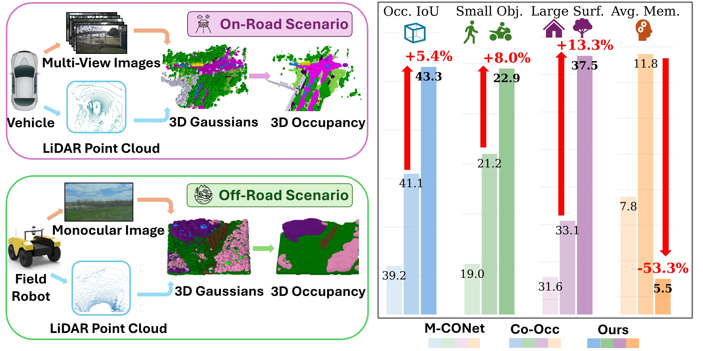
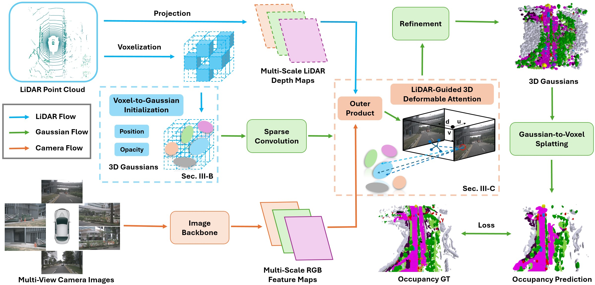

# GaussianFormer3D: Multi-Modal Gaussian-based Semantic Occupancy Prediction with 3D Deformable Attention
### [Paper](https://arxiv.org/abs/2505.10685)  | [Project Page](https://lunarlab-gatech.github.io/GaussianFormer3D/) 

> GaussianFormer3D: Multi-Modal Gaussian-based Semantic Occupancy Prediction with 3D Deformable Attention

> [Lingjun Zhao](https://junshao0104.github.io/), [Sizhe Wei](https://sizhewei.github.io/), [James Hays](https://faculty.cc.gatech.edu/~hays/), [Lu Gan](https://ganlumomo.github.io/)

> IEEE International Conference on Robotics and Automation (ICRA) 2026

We propose a new LiDAR-camera fusion-based semantic occupancy prediction framework using 3D Gaussian representations. We evaluate it on both on-road and off-road driving scenarios. Our method demonstrates superior performance on overall occupancy Intersection-of-Union (IoU), achieves substantial performance gains on small objects (e.g., pedestrian, motorcycle) and large surfaces (e.g., manmade, vegetation), and consumes less memory during inference.




## News
- **[2026/01/31]** GaussianFormer3D is accepted to ICRA 2026!
- **[2025/06/25]** Our Work is presented at RSS 2025 Workshop on Gaussian Representations for Robot Autonomy!


## Overview
3D semantic occupancy prediction is essential for achieving safe, reliable autonomous driving and robotic navigation. Compared to camera-only perception systems, multi-modal pipelines, especially LiDAR-camera fusion methods, can produce more accurate and fine-grained predictions. Although voxel-based scene representations are widely used for semantic occupancy prediction, 3D Gaussians have emerged as a continuous and significantly more compact alternative. In this work, we propose a multi-modal Gaussian-based semantic occupancy prediction framework utilizing 3D deformable attention, namely GaussianFormer3D. We introduce a voxel-to-Gaussian initialization strategy that provides 3D Gaussians with accurate geometry priors from LiDAR data, and design a LiDAR-guided 3D deformable attention mechanism to refine these Gaussians using LiDAR-camera fusion features in a lifted 3D space. Extensive experiments on real-world on-road and off-road autonomous driving datasets demonstrate that GaussianFormer3D achieves state-of-the-art prediction performance with reduced memory consumption and improved efficiency.




## Getting Started

### Installation
Follow [installation instructions](docs/installation.md) to set up the environment.

### NuScenes Dataset Preparation
1. Download [nuScenes V1.0 full dataset](https://www.nuscenes.org/download).

2. Download [depth_gt](https://gtvault-my.sharepoint.com/:u:/g/personal/lgan31_gatech_edu/IQCBLi4qkz3BTYkYpCkhCDdlAa89obWuT-B9_9spSIpHyKc?e=AcQ40b), and unzip it.

3. Download our provided [training pkl file](https://gtvault-my.sharepoint.com/:u:/g/personal/lgan31_gatech_edu/IQDzp89mUsswRo-F5LHpsDd9Acyr_rkXiDQFqsqKtVM3QKc?e=HJzivy) and [validation pkl file](https://gtvault-my.sharepoint.com/:u:/g/personal/lgan31_gatech_edu/IQDMK0Iz4Z9HQKYcMsdkCivfAYp2MlcEtBTXFA921dANiJU?e=aK9qey).

4. Download the occupancy annotations from [SurroundOcc](https://github.com/weiyithu/SurroundOcc) and unzip it.

### RELLIS3D Dataset Preparation
1. Download our prepared processed [Rellis3D-WildOcc dataset](https://gtvault-my.sharepoint.com/:u:/g/personal/lgan31_gatech_edu/IQDaUUBtXEInTaCS-zUgENA8AdbdhF6RUTK-YSmthiSg84U?e=nANsll), and unzip it.


**Folder structure**
```
GaussianFormer3D
├── ...
├── data/
│   ├── nuscenes/
│   │   ├── depth_gt/
│   │   ├── maps/
│   │   ├── samples/
│   │   ├── sweeps/
│   │   ├── v1.0-test/
|   |   ├── v1.0-trainval/
│   ├── nuscenes_cam/
│   │   ├── nuscenes_infos_gf3d_train.pkl
│   │   ├── nuscenes_infos_gf3d_val.pkl
│   ├── surroundocc/
│   │   ├── samples/
│   │   |   ├── xxxxxxxx.pcd.bin.npy
│   │   |   ├── ...
│   ├── WildOcc/
│   │   ├── data/
│   │   ├── Rellis-3D-calibration/
│   │   ├── Rellis-3D-split/
```

### Evaluation
We provided pre-trained weights of our model on [nuScenes-SurroundOcc](https://gtvault-my.sharepoint.com/:u:/g/personal/lgan31_gatech_edu/IQCoIH-VSc5tRrAxVbg8Pm4PARtX4wL0DGgD5qIbWYHFFRI?e=EBkysb) and on [Rellis3D-WildOcc](https://gtvault-my.sharepoint.com/:u:/g/personal/lgan31_gatech_edu/IQBiEZEI5j-dT42SlZ1dFTmdATaqH-srLAQmUD3uiYFv23Y?e=H308LU).

```bash
# Evaluation on nuScenes-SurroundOcc validation set
python eval.py --py-config config/nuscenes_surroundocc_gs25600.py --work-dir out/nuscenes_surroundocc_gs25600/ --resume-from out/nuscenes_surroundocc_gs25600/surroundocc_release.pth 
# Evaluation on Rellis3d-WildOcc test set
python test_wildocc.py --py-config config/rellis3d_wildocc_gs25600.py --work-dir out/rellis3d_wildocc_gs25600/ --resume-from out/rellis3d_wildocc_gs25600/wildocc_release.pth 
```


### Visualization

```bash
# Visualization on nuScenes-SurroundOcc
CUDA_VISIBLE_DEVICES=0 python visualize.py --py-config config/nuscenes_surroundocc_gs25600.py --work-dir out/nuscenes_surroundocc_gs25600 --resume-from out/nuscenes_surroundocc_gs25600/surroundocc_release.pth --vis-occ --vis-gaussian --num-samples 3
# Visualization on Rellis3d-WildOcc
CUDA_VISIBLE_DEVICES=0 python visualize_wildocc.py --py-config config/rellis3d_wildocc_gs25600.py --work-dir out/rellis3d_wildocc_gs25600 --resume-from out/rellis3d_wildocc_gs25600/wildocc_release.pth --vis-occ --vis-gaussian --num-samples 3
```


### Training
Download the pretrained weights for the [image backbone](https://github.com/zhiqi-li/storage/releases/download/v1.0/r101_dcn_fcos3d_pretrain.pth) and put it inside ckpts folder.
```bash
# Training on nuScenes-SurroundOcc
CUDA_VISIBLE_DEVICES=0,1,2,3,4,5,6,7 python train.py --py-config config/nuscenes_surroundocc_gs25600.py --work-dir out/nuscenes_surroundocc_gs25600
# Training on Rellis3d-WildOcc
CUDA_VISIBLE_DEVICES=0,1,2,3,4,5,6,7 python train_wildocc.py --py-config config/rellis3d_wildocc_gs25600.py --work-dir out/rellis3d_wildocc_gs25600
```

| Benchmark | Modality | Config | IoU | mIoU | Weight |
| :---: | :---: | :---: | :---: | :---: | :---: |
| nuScenes-SurroundOcc | L+C | nuscenes_surroundocc_gs25600.py | 43.3 | 27.1 | [weight](https://gtvault-my.sharepoint.com/:u:/g/personal/lgan31_gatech_edu/IQCoIH-VSc5tRrAxVbg8Pm4PARtX4wL0DGgD5qIbWYHFFRI?e=EBkysb) |
| Rellis3d-WildOcc | L+C | rellis3d_wildocc_gs25600.py | 33.9 | 13.1 | [weight](https://gtvault-my.sharepoint.com/:u:/g/personal/lgan31_gatech_edu/IQBiEZEI5j-dT42SlZ1dFTmdATaqH-srLAQmUD3uiYFv23Y?e=H308LU) |


## Related Projects

Our project builds upon [GaussianFormer](https://github.com/huang-yh/GaussianFormer), 
[BEVFormer](https://github.com/fundamentalvision/bevformer), 
[BEVDepth](https://github.com/megvii-basedetection/bevdepth), 
[DFA3D](https://github.com/IDEA-Research/3D-deformable-attention).
We sincerely thank the authors for their outstanding contributions to the community.

## Citation

If you find this project helpful, please consider citing the following paper:
```
@article{zhao2025gaussianformer3d,
  title={Gaussianformer3d: Multi-modal gaussian-based semantic occupancy prediction with 3d deformable attention},
  author={Zhao, Lingjun and Wei, Sizhe and Hays, James and Gan, Lu},
  journal={arXiv preprint arXiv:2505.10685},
  year={2025}
}
```
